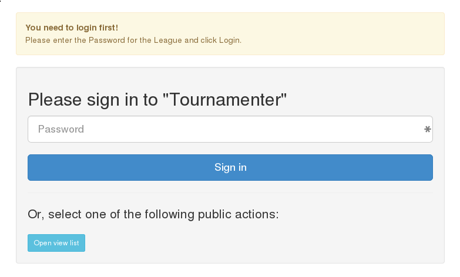

Basics
======

In order to use `tournamenter` it is necessary  to familiarize with the
basics. These include loggin into the application and navigating around.

Loggin in
---------

At RoboCup 2014 the tournamenter will run as a part of the internal
internet infrastructure. That means that you will receive an address, for
example `http://192.168.1.123:12345` which will be unique for your league.
Along with the address you will also receive a password which will be very
important since when you open the address mentioned above you will most
likely encounter the following:

where 'Tournamenter' might be the name of your league. To log into the
system you simply type in your password and press the blue 'Sign in'
button.

Navigating around
-----------------
As you have surely already noticed there is a toolbar with menu items at
the top of the `tournamenter` screen. Although some of the menu items might
be self-explanatory we will go through them one by one to make sure their
meaning is clear.

        insetead of 'Tournamenter'.

- **Teams**:  This menu item will be disabled at RoboCup 2014. The teams
    should be added via a different application.

- **Groups**: This menu item is the entry point for all leagues that are
  to some extend inspired by soccer. In here the teams can be arranged into
  groups, the matches for them can be created and the score of those
  matches can inserted into the database.

- **Tables**: This menu item will be used by every other league as it
  encapsulates inserting any kind of scores into a table -- just like into
  a spreadsheet.

- **Views**: This menu item will take you to a subsystem in which you can
  create visual presentations of scores that have already been inserted in
  for output devices (such as monitor screens, TVs, ...).

- **Logout**: by clicking on this screen you will log yourself out of the
  system and will have to use the password to log in again.
