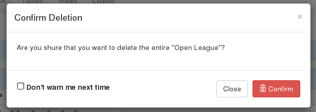

Groups
======

Introduction
------------

As you have already seen in the previous chapter the menu item that will
take you to the group management module of the system is located in
top-central part of any tournamenter page. When you click in on it for the
first time you will most likely see a screen that is very similar to this
one:

.. image:: img/group-empty.png
    :alt: The group listing without any groups in it.

That means that there are no groups at the moment. When you click on the
big **Create New Button** a new group will be added with default values
pre-filled and your screen will look like this:

.. image:: img/group-new.png
    :alt: The group listing with one new empty group.

There are a few options to do right away. First of all the name of the
group is by default '[New Group]' (you can see it on the left side). This
just a placeholder and is meant to be changed. You can easily do so by
clicking on the name and changing the text in the input box. Once you are
satisfied with the name of this group you can confirm and save it by
clicking on the white tick right next to the input box (or pressing Enter).

If you clicked on the group name by mistake no worries! By either clicking
on the 'x' icon next to the white tick or anywhere else on the page
the group name will be reset to its previous value.

.. image:: img/group-name.png
    :alt: The input box with other buttons which you will see after
        clicking on the group name.

There are two more buttons on the right. The first one has 'Refresh'
written on it and it is used for refreshing the current table with new data
from the database. Its purpose will be described in more detail in the
following sections. At this time we shall note that it doesn't hurt to just
click on it after changing/inserting anything within the group.

The functionality of the 'Delete Group' button is pretty straightforward:
it deletes the group. When you click on it you will see the following
dialog in which you assure the system that deleting the group is really
what you want.

        'Delete Group' button.
