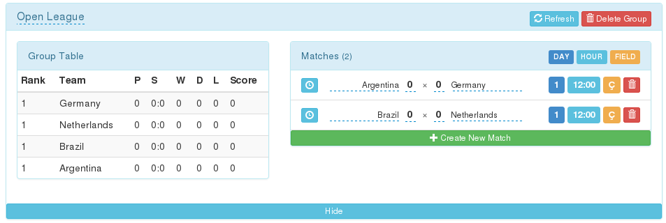

Groups
======

As described earilier, groups are a module of the system used for
soccer-related leagues. They make it easy to add arrange teams into groups
and schedule matches between teams.

Introduction
------------

As you have already seen in the previous chapter the menu item that will
take you to the group management module of the system is located in
top-central part of any tournamenter page. When you click in on it for the
first time you will most likely see a screen that is very similar to this
one:

.. figure:: img/group-empty.png
    :alt: The group listing without any groups in it.

That means that there are no groups at the moment. When you click on the
big **Create New Button** a new group will be added with default values
pre-filled and your screen will look like this:

.. figure:: img/group-new.png
    :alt: The group listing with one new empty group.

There are a few things you can do with a newly created group right away.
First of all the name of the group is by default '[New Group]' (you can see
it on the left side). This just a placeholder and is meant to be changed.
You can easily do so by clicking on the name and changing the text in the
input box. Once you are satisfied with the name of this group you can
confirm and save it by clicking on the white tick right next to the input
box (or pressing Enter).

If you clicked on the group name by mistake no worries! By either clicking
on the 'x' icon next to the white tick or anywhere else on the page
the group name will be reset to its previous value.

        clicking on the group name.

There are two more buttons on the right. The first one has 'Refresh'
written on it and it is used for refreshing the current table with new data
from the database. Its purpose will be described in more detail in the
following sections. At this time we shall note that it doesn't hurt to just
click on it after changing/inserting anything within the group.

The functionality of the 'Delete Group' button is pretty straightforward:
it deletes the group. When you click on it you will see the following
dialog in which you assure the system that deleting the group is really
what you want.

        'Delete Group' button.

As you have certainly noticed there is a dark blue button that says 'Show'
just below the group name. When you click on it you will see something very
similar to the picture below:

.. figure:: img/group-opened.png
    :align: center
    :alt: The opened management screen of an empty group.

We call this the group management screen. In here you can add teams to a
group, schedule matches, assign them to fields and more. We will discuss
that in the next section.

Managing groups
---------------

If we look at soccer competitions in general there are basically two things
that are interesting: who and when is playing against whom and how is the
result of that much going to reflect in some kind of general scoring.

Sheduling matches
~~~~~~~~~~~~~~~~~

In `tournamenter` you start by sheduling matches. Doing that is very easy.
You can add one by clicking on 'Create New Match'. What you should see is
something like this:

As you can see, there is *Empty* sign in italics where you would expect a
team name. This is intentional as you should change this placeholder to
some team. You can do so easily by clicking at *Empty* and choosing a team
from a dropdown that shows up.

After choosing a team you will see that its name will appear in the group
table on the right. The `tournamenter`'s way of arranging teams into groups
is by scheduling matches between these teams. For instance:

Setting attributes of matches
~~~~~~~~~~~~~~~~~~~~~~~~~~~~~

Although choosing the teams that should play a match against each other is
indeed crucial, it is only one part of the process of scheduling a match.
As you might have noted in the matches listing there are a few more
buttons: DAY, HOUR and FIELD.

After clicking on any of these buttons a popup will show up in which you
can edit the value that is currently set. Note that you confirm the value
you have changed by pressing Enter. Similarly to the other popups, you can
just let it reset to its current value by clicking somewhere else on the
page.

As you might expect the trash icon will try to remove the match altogether
after asking for your confirmation.

Setting the state of a match
~~~~~~~~~~~~~~~~~~~~~~~~~~~~

The last button we haven't mentioned so far is the blue 'clock' button on
the left. This button is used to change the state of the match. Match can
have three states:

- **Scheduled**: the match has been created and it is ready to be played.
- **Playing**: the match is being played at the moment
- **Ended**: the match has already been played and the results should be
  reflected in the scoring table.

You can easily change the state of a match by clicking on the blue 'clock'
icon and choosing from a popup that opens up. Once you change the state the
'clock' icon will change to reflect the current state.

Scoring
~~~~~~~

Changing the score of a match is as easy as clicking on the current score
(a number in bold text to the team name) and changing the value to the
desired one.

It should be noted that the data will only get reflected in the table (and
thus the table will get updated) when the match is in the **Ended** state.

Also, it is necessary to note at this point that it is always a good idea
to click on the 'Refresh' button before changing any match data.
